# ✅ Node.js Shop Bill / Invoice Application

## MySQL RDS + Nginx Reverse Proxy on AWS (2 EC2)

**Author: Suraj Molke**

------------------------------------------------------------------------

## 1️⃣ Architecture

    Internet
       |
       | HTTP : 80
       |
    [ EC2-1 : Reverse Proxy (Nginx) ]
       |
       | HTTP : 3000 (Private)
       |
    [ EC2-2 : Node.js App ]
       |
       | MySQL : 3306
       |
    [ Amazon RDS MySQL ]

------------------------------------------------------------------------

## 2️⃣ AWS Infrastructure Setup

### 🔹 EC2 Instances
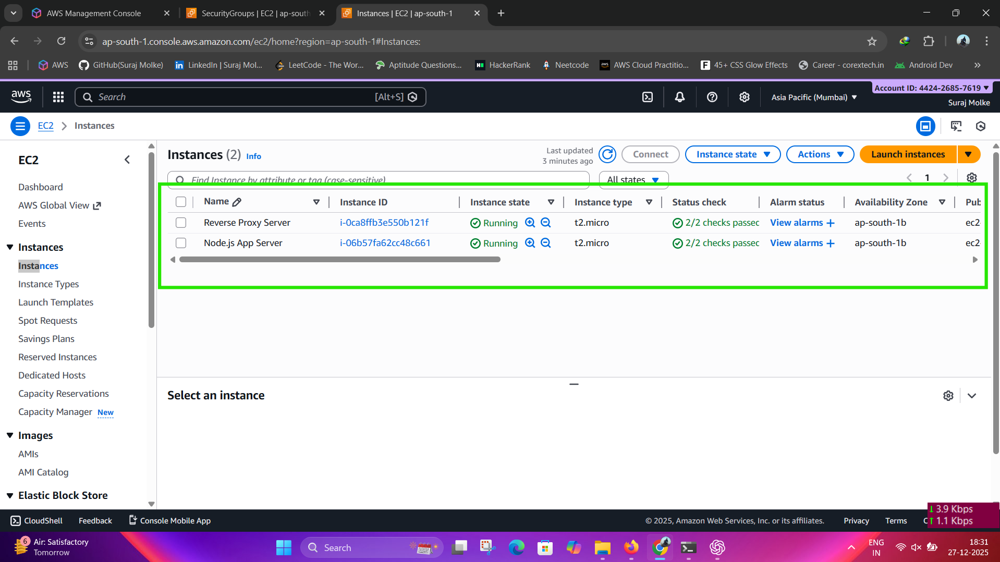
#### EC2-1: Reverse Proxy

-   AMI: Amazon Linux 2
-   Security Group:
    -   80 → 0.0.0.0/0
    -   22 → Your IP

#### EC2-2: Node Application

-   AMI: Amazon Linux 2
-   Security Group:
    -   3000 → Only from Proxy SG
    -   22 → Your IP

### 🔹 Amazon RDS MySQL

-   Engine: MySQL 8.x
-   DB Name: shopdb
-   Username: admin
-   Port: 3306
-   Public Access: ❌ No
-   SG: Allow 3306 only from Node EC2 SG
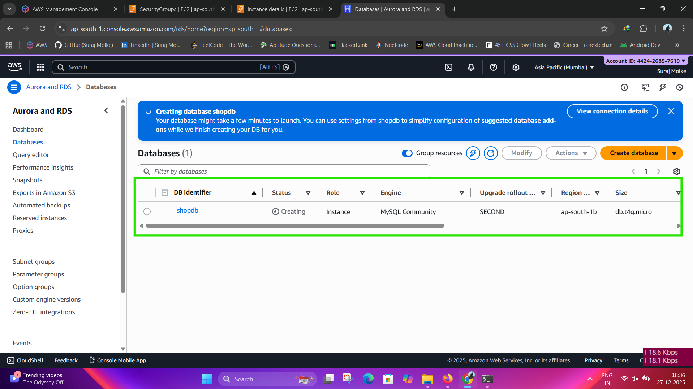
------------------------------------------------------------------------

## 3️⃣ Database Setup (RDS)

``` sql
CREATE DATABASE shopdb;
USE shopdb;

CREATE TABLE invoices (
    id INT AUTO_INCREMENT PRIMARY KEY,
    customer_name VARCHAR(100),
    product_name VARCHAR(100),
    quantity INT,
    price DECIMAL(10,2),
    total DECIMAL(10,2),
    created_at TIMESTAMP DEFAULT CURRENT_TIMESTAMP
);
```

------------------------------------------------------------------------

## 4️⃣ Node Application Setup

### 🔹 Install Node.js

``` bash
curl -fsSL https://rpm.nodesource.com/setup_18.x | sudo bash -
sudo yum install -y nodejs
```
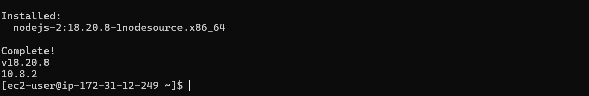
### 🔹 Create Project

``` bash
mkdir shop-bill-app
cd shop-bill-app
npm init -y
```

### 🔹 Install Packages

``` bash
npm install express mysql2 body-parser dotenv
```

------------------------------------------------------------------------
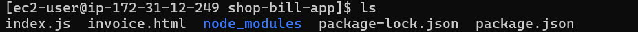

## 5️⃣ Application Code

### 🔹 index.js

``` js
const express = require('express');
const mysql = require('mysql2');
const bodyParser = require('body-parser');

const app = express();
app.use(bodyParser.urlencoded({ extended: true }));
app.use(bodyParser.json());

// Database Connection
const db = mysql.createConnection({
  host: 'YOUR-RDS-ENDPOINT',
  user: 'admin',
  password: 'YOUR_PASSWORD',
  database: 'shopdb'
});

db.connect(err => {
  if (err) {
    console.log('DB Error:', err);
  } else {
    console.log('MySQL Connected');
  }
});

// Home Page
app.get('/', (req, res) => {
  res.sendFile(__dirname + '/invoice.html');
});

// Submit Invoice
app.post('/submit', (req, res) => {
  const { customer, product, quantity, price } = req.body;
  const total = quantity * price;

  const sql = `
    INSERT INTO invoices 
    (customer_name, product_name, quantity, price, total)
    VALUES (?, ?, ?, ?, ?)
  `;

  db.query(sql, [customer, product, quantity, price, total], (err) => {
    if (err) throw err;
    res.send('<h2>Invoice Saved Successfully</h2>');
  });
});

app.listen(3000, () => {
  console.log('Node App running on port 3000');
});

```

### 🔹 invoice.html

``` html
<!DOCTYPE html>
<html lang="en">
<head>
  <meta charset="UTF-8">
  <title>Shop Invoice</title>

  <style>
    body {
      margin: 0;
      padding: 0;
      font-family: 'Segoe UI', Tahoma, sans-serif;
      background: linear-gradient(135deg, #0f2027, #203a43, #2c5364);
      color: #fff;
      min-height: 100vh;
      display: flex;
      flex-direction: column;
      align-items: center;
      justify-content: center;
    }

    h2 {
      text-align: center;
      margin-bottom: 20px;
      text-shadow: 0 0 10px #00e6ff;
    }

    form {
      background: rgba(0, 0, 0, 0.4);
      padding: 25px 35px;
      border-radius: 12px;
      box-shadow: 0 0 20px #00e6ff;
      width: 320px;
    }

    input {
      width: 100%;
      padding: 10px;
      margin-top: 6px;
      margin-bottom: 15px;
      border-radius: 6px;
      border: none;
      outline: none;
      font-size: 14px;
      box-shadow: 0 0 8px rgba(0, 230, 255, 0.6);
    }

    input:focus {
      box-shadow: 0 0 12px #00e6ff;
    }

    button {
      width: 100%;
      padding: 12px;
      border: none;
      border-radius: 6px;
      background: #00e6ff;
      color: #000;
      font-size: 16px;
      font-weight: bold;
      cursor: pointer;
      transition: 0.3s;
      box-shadow: 0 0 15px #00e6ff;
    }

    button:hover {
      background: #00b8cc;
      box-shadow: 0 0 25px #00e6ff;
    }

    footer {
      margin-top: 30px;
      text-align: center;
      font-size: 13px;
      color: #cfd8dc;
    }

    footer a {
      color: #00e6ff;
      text-decoration: none;
      margin: 0 5px;
    }

    footer a:hover {
      text-decoration: underline;
      text-shadow: 0 0 8px #00e6ff;
    }
  </style>
</head>

<body>

  <h2>Shop Bill Invoice</h2>

  <form action="/submit" method="post">
    Customer Name:
    <input type="text" name="customer" required>

    Product Name:
    <input type="text" name="product" required>

    Quantity:
    <input type="number" name="quantity" required>

    Price:
    <input type="number" name="price" required>

    <button type="submit">Submit Invoice</button>
  </form>

  <footer>
    <p>
      Created by <strong>Suraj Molke</strong> |
      <a href="https://www.linkedin.com/in/suraj-molke" target="_blank">LinkedIn</a> |
      <a href="https://github.com/surajmolke/shop-invoice-nodejs" target="_blank">GitHub Repo</a>
    </p>
  </footer>

</body>
</html>
```

------------------------------------------------------------------------

## 6️⃣ Run Application

``` bash
node index.js
```
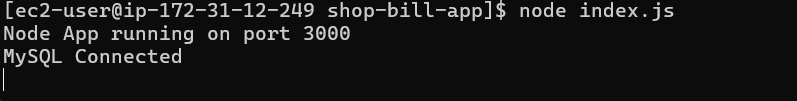
## Node.js 3000 show page
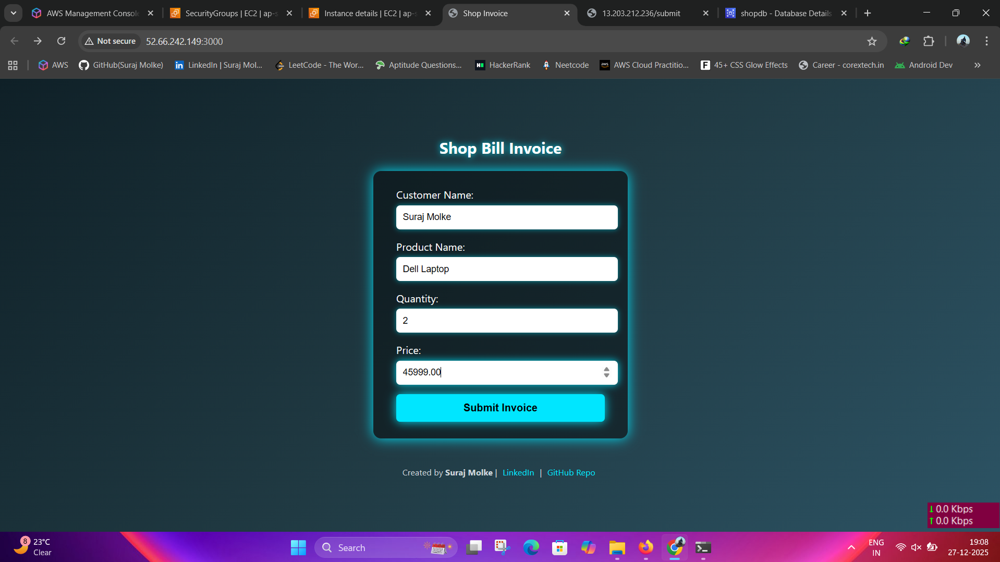
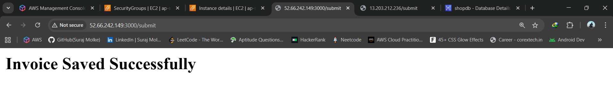

### ✔ Recommended (PM2)

``` bash
sudo npm install -g pm2
pm2 start index.js
pm2 save
pm2 startup
```
------------------------------------------------------------------------

## 7️⃣ Nginx Reverse Proxy Setup

``` bash
sudo yum install nginx -y
sudo systemctl start nginx
sudo systemctl enable nginx
```

### 🔹 Config

``` nginx
server {
    listen 80;
    location / {
        proxy_pass http://NODE_PRIVATE_IP:3000;
        proxy_set_header Host $host;
        proxy_set_header X-Real-IP $remote_addr;
    }
}
```

------------------------------------------------------------------------
## 2nd EC2 Resverse Proxy Nginx Config
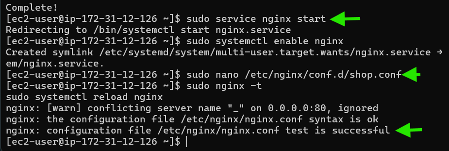

## 8️⃣ Security Hardening

-   Block public access to Node port 3000
-   Allow 3000 only from Proxy SG
-   RDS allows 3306 only from Node EC2 SG

------------------------------------------------------------------------

## 9️⃣ Access Application

    http://<PROXY_PUBLIC_IP>

------------------------------------------------------------------------
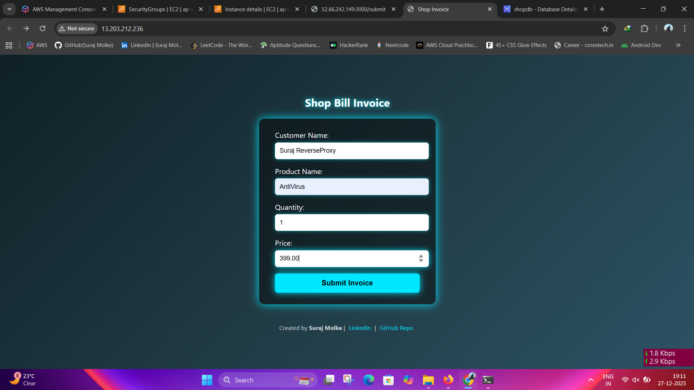
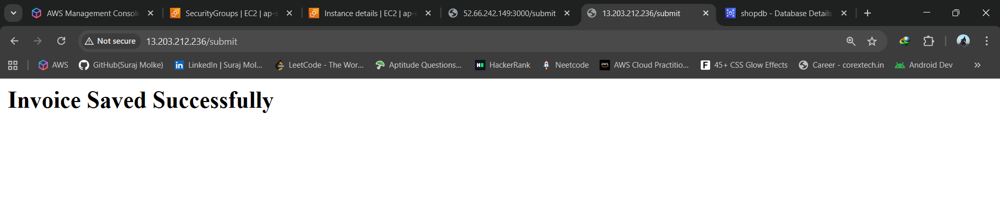
## 🔟 Verify Database

``` sql
SELECT * FROM invoices;
```

------------------------------------------------------------------------
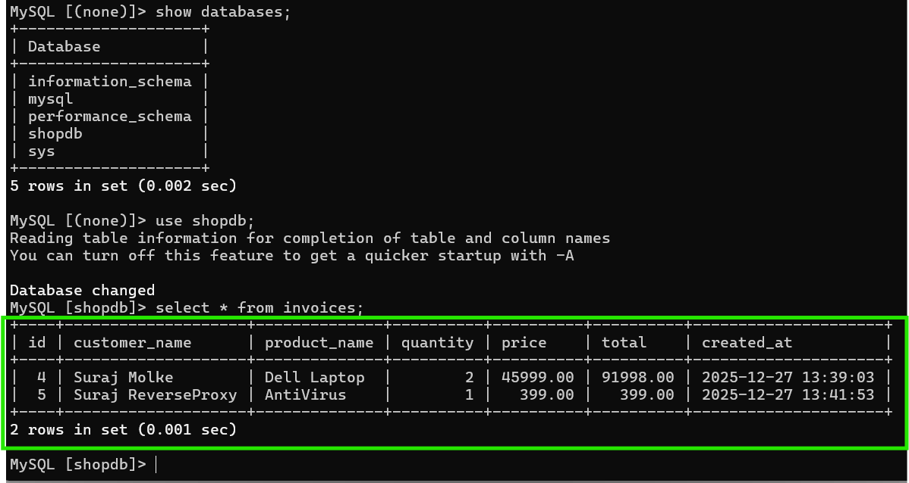
## ✅ Conclusion

Production-style Node.js deployment using AWS EC2, Nginx reverse proxy,
and RDS MySQL.
